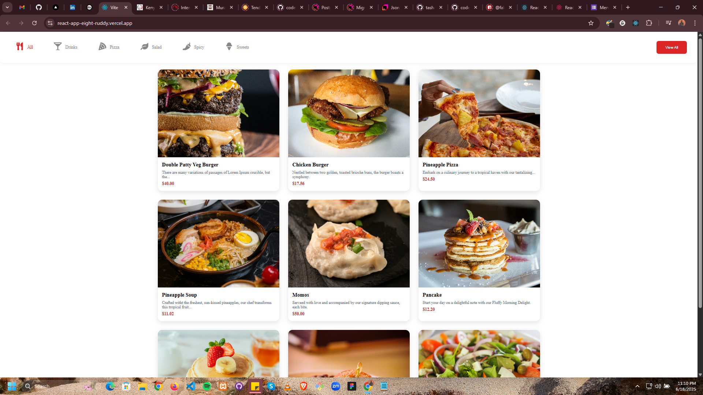

# React Food App

A modern and responsive food listing application built with React. The project features a clean user interface with categorized food items, stylish cards, and responsive design – perfect for restaurants, food delivery platforms, or frontend portfolio demos.

## Tech Stack

- React (Vite)
- CSS3 with custom properties and media queries
- Component-based architecture

## Installation & Setup

1. Clone the repository:

```bash
git clone https://github.com/sakamw/React-APP
cd react-app
```

1. Install dependencies:

```bash
pnpm install
```

1. Run the development server:

```bash
pnpm run dev
```


